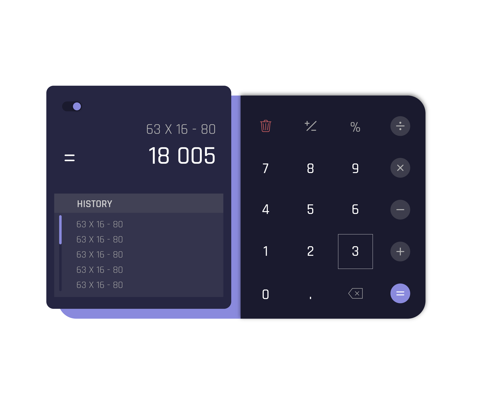

# SIMPLE CALCULATOR - `with history caching and dark mode`
• JavaScript • CSS • BEM • Gulp •
---

## Description
A simple calculator for addition, subtraction, multiplication, division and modulus calculation

*source css and js file in src folder*

## Features
- Portriat and Landscape Design
- Theme toggle between light and dark mode
- Maximum number of input characters allowed is 16
- Answer limit is 8 digits or converted to exponential

## Test Cases
---
### `Theme`
- Selected theme is saved and initialized on next reload

### `Display`
- Expression is displayed separately from the Solution
- Expression maximum number of character is 16
- For solutions larger than 8 digits are converted to exponential
- Operators are whitespaced from digits 

### `Keypress Operations`
> 0 
  - cannot start an expression

> 1 - 9
  - can be used anywhere in any expression

> .
  - cannot start an expression
  - if typed as the first character of an expression number, the display will be updated to `0.`

> \- (minus)
  - works as minus operator
  - can start an expression (to produce negative numbers e.g. -2.3)
  - if preceeding character is \- or +, it cycles the sign accordingly

> \+ , x, ÷, %
  - works as addition, multiplication, division and modulus operator respectively
  - cannot be typed first

> =
 - evaluates an expression and displays the answer
 - moves the expression to the history log

> ANS
  - displays the previous computed answer in the expression
  - can only be used as the first character of an expression number (e.g. pressing `2` and then `ANS` will not work)

> <= (backspace button)
  - deletes the last character on the expression log

> (trash button)
  - deletes the whole expression when **clicked**
  - deletes the whole expression, empties the history log and clears the last answer when **double-clicked**

> History Log
  - Stores the last 10 expressions that was computed, scrollable vertically
  - If same espression are evaluated consecutively, only one log is created
  - Clicking any history will display the saved expression in the expression screen for further computations
